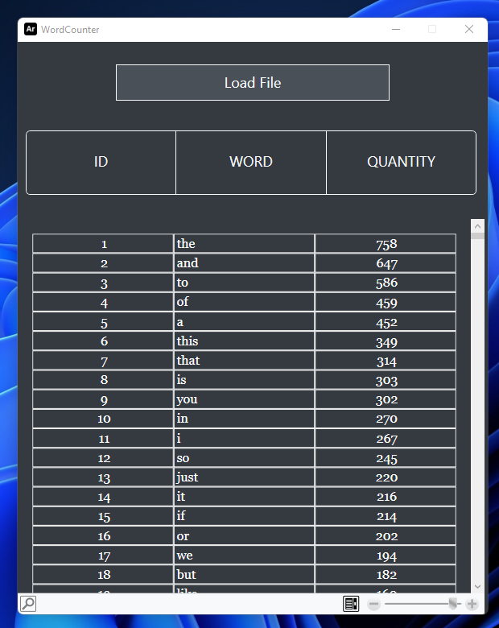

# WordCounter
É um programa simples em WPF, para separar as palavras em um arquivo de texto e  
mostrar a quantidade de vezes que aparecem, foi criado apenas como uma ferramenta  
auxiliar para aprendizado do inglês.

-----

## Screenshot

